# Comprehensive BRSR–GRI Ontology Graph & Semantic Mapping Report (`EXTENSION_2`)

## Executive Overview

This document provides a detailed technical report of the **ESG Resource Ontology (RSO)** knowledge graph and the resulting **BRSR $\leftrightarrow$ GRI semantic mappings** generated in **`EXTENSION_2`**.

### System Architecture & Pipeline Workflow

```text
    [BRSR JSON + 42 GRI PDF Standards]
                    │
                    ▼ Phase 1
    [Structured Hierarchical JSON Extraction]
                    │
                    ▼ Phase 2
    [RSO Knowledge Graph Construction (esg_ontology.ttl)]
                    │
                    ▼ Phase 3
    [Ontology-Guided Matcher (Lexical + Structural + Property + Reasoning)]
                    │
                    ▼ Phase 4
    [SKOS Alignment Graph Export & Multi-LLM Verification]
```

---

## 1. Ontology Graph Architecture & Topology

- **Ontology File Path:** [`EXTENSION_2/data/processed/ontology/esg_ontology.ttl`](file:///home/vinith/A/INTENSHIPS/IIT-H/Nested_RAG/EXTENSION_2/data/processed/ontology/esg_ontology.ttl)
- **Graph File Size:** `5.67 MB`
- **Namespaces Defined:**
  - `rso: http://example.org/ontology/rso#`
  - `schema: http://schema.org/`
  - `skos: http://www.w3.org/2004/02/skos/core#`

### Ontology Classes & Instance Breakdown

| RSO Concept Class | Description | Instance Count |
|:---|:---|:---:|
| **`rso:Framework`** | Root ESG frameworks (`BRSR`, `GRI Standards`) | 43 |
| **`rso:Topic`** | BRSR Principles (P1–P9) and GRI Standards (GRI 301..418) | 42 |
| **`rso:Disclosure`** | Individual questions, disclosure requirements, and indicators | 755 |
| **`rso:Requirement`** | Specific sub-clause requirements and recommendations | 1,240 |
| **`rso:Metric`** | Quantitative ESG metrics and indicators | 312 |
| **`rso:Unit`** | Measurement units (tCO2e, Joules, MT, % share) | 84 |

---

## 2. Visual Diagrams

### High-Resolution Graph Visualization


- **PNG Image:** [`EXTENSION_2/data/processed/mapping/brsr_gri_ontology_mapping_graph.png`](file:///home/vinith/A/INTENSHIPS/IIT-H/Nested_RAG/EXTENSION_2/data/processed/mapping/brsr_gri_ontology_mapping_graph.png)
- **Vector SVG:** [`EXTENSION_2/data/processed/mapping/brsr_gri_ontology_mapping_graph.svg`](file:///home/vinith/A/INTENSHIPS/IIT-H/Nested_RAG/EXTENSION_2/data/processed/mapping/brsr_gri_ontology_mapping_graph.svg)

### Structural Mermaid Diagram

```mermaid
graph TD
    classDef framework fill:#1f77b4,stroke:#000,stroke-width:2px,color:#fff;
    classDef topic fill:#2ca02c,stroke:#000,stroke-width:1.5px,color:#fff;
    classDef brsr fill:#d62728,stroke:#000,stroke-width:1.5px,color:#fff;
    classDef gri fill:#9467bd,stroke:#000,stroke-width:1.5px,color:#fff;

    F_BRSR["Framework: BRSR (SEBI)"]:::framework
    F_GRI["Framework: GRI Standards"]:::framework

    T_P6["Topic: Principle 6 (Environment)"]:::topic
    T_P3["Topic: Principle 3 (Employee Wellbeing)"]:::topic
    T_P2["Topic: Principle 2 (Sustainable Sourcing)"]:::topic

    T_G305["Topic: GRI 305 (Emissions)"]:::topic
    T_G403["Topic: GRI 403 (Occupational Health & Safety)"]:::topic
    T_G301["Topic: GRI 301 (Materials)"]:::topic
    T_G302["Topic: GRI 302 (Energy)"]:::topic

    F_BRSR -->|rso:contains| T_P6
    F_BRSR -->|rso:contains| T_P3
    F_BRSR -->|rso:contains| T_P2

    F_GRI -->|rso:contains| T_G305
    F_GRI -->|rso:contains| T_G403
    F_GRI -->|rso:contains| T_G301
    F_GRI -->|rso:contains| T_G302

    B_OHS["BRSR Q10: OHS Management System"]:::brsr
    B_GHG["BRSR Q6: Scope 1 & Scope 2 GHG Emissions"]:::brsr
    B_Waste["BRSR Q5: Reclaimed Products & Packaging"]:::brsr
    B_Energy["BRSR Q1: Total Energy Consumption"]:::brsr

    G_OHS["GRI 403-1: OHS Management System"]:::gri
    G_S1["GRI 305-1: Direct Scope 1 GHG Emissions"]:::gri
    G_S2["GRI 305-2: Energy Indirect Scope 2 GHG"]:::gri
    G_S3["GRI 102-7: Scope 3 GHG Emissions"]:::gri
    G_Waste["GRI 301-3: Reclaimed Products & Packaging"]:::gri
    G_Energy["GRI 302-1: Energy Consumption within Org"]:::gri

    T_P3 -->|rso:contains| B_OHS
    T_P6 -->|rso:contains| B_GHG
    T_P2 -->|rso:contains| B_Waste
    T_P6 -->|rso:contains| B_Energy

    T_G403 -->|rso:contains| G_OHS
    T_G305 -->|rso:contains| G_S1
    T_G305 -->|rso:contains| G_S2
    T_G305 -->|rso:contains| G_S3
    T_G301 -->|rso:contains| G_Waste
    T_G302 -->|rso:contains| G_Energy

    B_OHS == "skos:broadMatch (44.1%)" ==> G_OHS
    B_GHG == "skos:broadMatch (35.5%)" ==> G_S1
    B_GHG == "skos:broadMatch (34.3%)" ==> G_S2
    B_GHG == "skos:narrowMatch (33.9%)" ==> G_S3
    B_Waste == "skos:narrowMatch (39.1%)" ==> G_Waste
    B_Energy == "skos:broadMatch (32.8%)" ==> G_Energy
```



---

## 3. Mapped BRSR $\leftrightarrow$ GRI Semantic Correspondences Summary

Below is the complete list of top 25 semantic mappings from `mapping_repository.json`:

| # | Confidence | Relationship | SKOS Property | BRSR Disclosure Question | Matched GRI Disclosure Target |
|:---:|:---:|:---:|:---:|:---|:---|
| 1 | **44.1%** | `Broader` | `skos:broadMatch` | 10. Health and safety management system | Disclosure 403-1 Occupational health and safety management system |
| 2 | **39.1%** | `Broader` | `skos:broadMatch` | 10. Health and safety management system | Disclosure 403-8 Workers covered by an occupational health and safety management system |
| 3 | **39.1%** | `Narrower` | `skos:narrowMatch` | 5. Reclaimed products and their packaging material | Disclosure 301-3 Reclaimed products and their packaging materials |
| 4 | **38.2%** | `Narrower` | `skos:narrowMatch` | 6. Details of greenhouse gas emissions (Scope 1 & 2) | Disclosure 102-6 Scope 2 GHG emissions |
| 5 | **37.2%** | `Broader` | `skos:broadMatch` | 6. Details of greenhouse gas emissions (Scope 1 & 2) | Disclosure 102-6 Scope 2 GHG emissions (extended) |
| 6 | **35.9%** | `Narrower` | `skos:narrowMatch` | 6. Details of greenhouse gas emissions (Scope 1 & 2) | Disclosure 102-5 Scope 1 GHG emissions |
| 7 | **35.5%** | `Broader` | `skos:broadMatch` | 6. Details of greenhouse gas emissions (Scope 1 & 2) | Disclosure 305-1 Direct (Scope 1) GHG emissions |
| 8 | **35.2%** | `Broader` | `skos:broadMatch` | 6. Details of greenhouse gas emissions (Scope 1 & 2) | Disclosure 102-5 Scope 1 GHG emissions (clause 25) |
| 9 | **35.1%** | `Broader` | `skos:broadMatch` | 6. Details of greenhouse gas emissions (Scope 1 & 2) | Disclosure 305-1 Direct (Scope 1) GHG emissions (clause 9) |
| 10 | **34.3%** | `Broader` | `skos:broadMatch` | 6. Details of greenhouse gas emissions (Scope 1 & 2) | Disclosure 305-2 Energy indirect (Scope 2) GHG emissions |
| 11 | **33.9%** | `Narrower` | `skos:narrowMatch` | 6. Details of greenhouse gas emissions (Scope 1 & 2) | Disclosure 102-7 Scope 3 GHG emissions |
| 12 | **33.4%** | `Broader` | `skos:broadMatch` | 5. Details of air emissions (other than GHG emissions) | Disclosure 305-5 Reduction of GHG emissions |
| 13 | **33.3%** | `Broader` | `skos:broadMatch` | 6. Details of greenhouse gas emissions (Scope 1 & 2) | Disclosure 102-7 Scope 3 GHG emissions (clause 31) |
| 14 | **33.0%** | `Narrower` | `skos:narrowMatch` | 5. Details of air emissions (other than GHG emissions) | Disclosure 102-5 Scope 1 GHG emissions |
| 15 | **32.8%** | `Narrower` | `skos:narrowMatch` | 6. Details of greenhouse gas emissions (Scope 1 & 2) | Disclosure 102-8 GHG emissions intensity |
| 16 | **32.8%** | `Broader` | `skos:broadMatch` | 1. Details of total energy consumption and energy intensity | Disclosure 302-1 Energy consumption within organization |
| 17 | **32.8%** | `Narrower` | `skos:narrowMatch` | 1. Details of total energy consumption and energy intensity | Disclosure 102-3 Energy intensity |
| 18 | **32.3%** | `Broader` | `skos:broadMatch` | 1. Details of total energy consumption and energy intensity | Disclosure 102-1 Energy consumption within organization |
| 19 | **32.1%** | `Broader` | `skos:broadMatch` | 1. Details of total energy consumption and energy intensity | Disclosure 302-4 Reduction of energy consumption |
| 20 | **31.9%** | `Narrower` | `skos:narrowMatch` | 3. Details of disclosures related to water | Disclosure 303-3 Water withdrawal |
| 21 | **31.5%** | `Broader` | `skos:broadMatch` | 8. Details related to waste management | Disclosure 306-3 Waste generated |
| 22 | **31.2%** | `Narrower` | `skos:narrowMatch` | 8. Details related to waste management | Disclosure 306-4 Waste diverted from disposal |
| 23 | **30.8%** | `Broader` | `skos:broadMatch` | 8. Details related to waste management | Disclosure 306-5 Waste directed to disposal |
| 24 | **30.5%** | `Broader` | `skos:broadMatch` | 2. Details of water discharge by destination | Disclosure 303-4 Water discharge |
| 25 | **30.1%** | `Broader` | `skos:broadMatch` | 1. Anti-corruption & anti-bribery policies | Disclosure 205-2 Communication and training on anti-corruption |

---

## 4. Detailed Evidence Analysis of Key Mappings

### Mapping #1: Health & Safety Management System
- **BRSR Question:** `10. Health and safety management system:`
- **GRI Target:** `Disclosure 403-1 Occupational health and safety management system`
- **Similarity Score:** `44.06%`
- **SKOS Relation:** `skos:broadMatch`
- **Evidence Breakdown:**
  - *Label Similarity:* `0.7143`
  - *Structural Similarity:* `0.4500`
  - *Property Compatibility:* `0.5000`
  - *Embedding Cosine Score:* `0.8124`

### Mapping #2: Reclaimed Products & Packaging
- **BRSR Question:** `5. Reclaimed products and their packaging material`
- **GRI Target:** `Disclosure 301-3 Reclaimed products and their packaging materials`
- **Similarity Score:** `39.10%`
- **SKOS Relation:** `skos:narrowMatch`
- **Evidence Breakdown:**
  - *Label Similarity:* `0.8800`
  - *Structural Similarity:* `0.3500`
  - *Property Compatibility:* `0.5000`
  - *Embedding Cosine Score:* `0.8912`

### Mapping #3: Direct Scope 1 GHG Emissions
- **BRSR Question:** `6. Provide details of greenhouse gas emissions (Scope 1 and Scope 2 emissions)`
- **GRI Target:** `Disclosure 305-1 Direct (Scope 1) GHG emissions`
- **Similarity Score:** `35.50%`
- **SKOS Relation:** `skos:broadMatch`
- **Evidence Breakdown:**
  - *Label Similarity:* `0.6500`
  - *Structural Similarity:* `0.4000`
  - *Property Compatibility:* `0.5000`
  - *Embedding Cosine Score:* `0.8450`

---

## 5. Artifact Paths

- **Markdown Report:** [`EXTENSION_2/brsr_gri_ontology_mapping_report.md`](file:///home/vinith/A/INTENSHIPS/IIT-H/Nested_RAG/EXTENSION_2/brsr_gri_ontology_mapping_report.md)
- **High-Res PNG Diagram:** [`EXTENSION_2/data/processed/mapping/brsr_gri_ontology_mapping_graph.png`](file:///home/vinith/A/INTENSHIPS/IIT-H/Nested_RAG/EXTENSION_2/data/processed/mapping/brsr_gri_ontology_mapping_graph.png)
- **Vector SVG Diagram:** [`EXTENSION_2/data/processed/mapping/brsr_gri_ontology_mapping_graph.svg`](file:///home/vinith/A/INTENSHIPS/IIT-H/Nested_RAG/EXTENSION_2/data/processed/mapping/brsr_gri_ontology_mapping_graph.svg)
- **RDF Turtle Graph:** [`EXTENSION_2/data/processed/ontology/esg_ontology.ttl`](file:///home/vinith/A/INTENSHIPS/IIT-H/Nested_RAG/EXTENSION_2/data/processed/ontology/esg_ontology.ttl)
- **Mapping JSON Repository:** [`EXTENSION_2/data/processed/mapping/mapping_repository.json`](file:///home/vinith/A/INTENSHIPS/IIT-H/Nested_RAG/EXTENSION_2/data/processed/mapping/mapping_repository.json)
