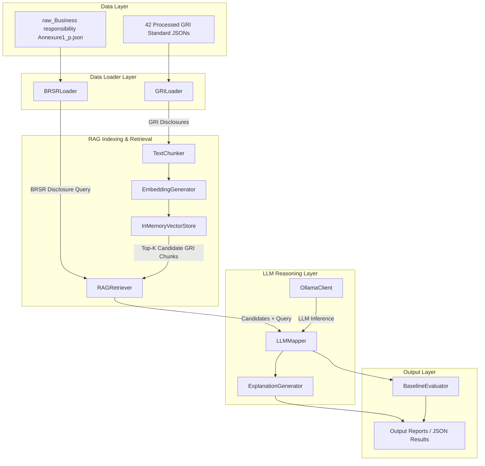

# Independent Baseline LLM Mapping Framework (`llm_mapping`)

> **IMPORTANT**: This framework is a **completely independent baseline system** built for direct empirical comparison against the ontology-guided semantic alignment framework. It **does NOT use or reuse** any ontology, RDF, OWL, Neo4j, graph database, ontology matcher, ontology reasoning, or SKOS mapping modules.

---

## 1. System Architecture

The framework is structured as a modular, decoupled pipeline:

```
EXTENSION_2/llm_mapping/
├── config/
│   ├── settings.py      # Global configuration (paths, RAG params, Ollama settings)
│   └── prompts.py       # Prompt templates for RAG-LLM semantic mapping & rationale
├── data/
│   ├── brsr_loader.py   # Loader & dataclasses for BRSR disclosures
│   └── gri_loader.py    # Loader & dataclasses for GRI disclosures across 42 standards
├── rag/
│   ├── chunker.py       # Text chunker for indexing disclosure texts
│   ├── embeddings.py    # Dense vector embedding generator interfaces
│   ├── vector_store.py  # Cosine-similarity in-memory vector store
│   └── retriever.py     # RAG candidate retriever for BRSR queries
├── llm/
│   ├── ollama_client.py # REST API client interface for local/remote Ollama LLM
│   ├── mapper.py        # Baseline LLM disclosure mapper (RAG + Prompt Reasoning)
│   └── explanation.py   # Rationale & explanation generation utility
├── evaluation/
│   └── evaluator.py     # Evaluation metrics (Precision, Recall, F1, Accuracy)
├── output/              # Directory for alignment outputs & execution logs
├── utils/
│   └── logging_config.py# Centralized logging utility
├── main.py              # Phase 1 initialization & verification entrypoint
└── README.md            # System documentation
```

---

## 2. Data Flow Diagram



---

## 3. Data Loaders

- **BRSR Loader (`data/brsr_loader.py`)**:
  - Parses `raw_Business responsibility and sustainability reporting by listed entitiesAnnexure1_p.json`.
  - Recursively extracts disclosures from Section A, B, and Principle-wise indicators (Principles 1-9).
  - Returns `List[BRSRDisclosure]`.

- **GRI Loader (`data/gri_loader.py`)**:
  - Reads all 42 processed GRI JSON standards in `EXTENSION_2/data/processed/`.
  - Extracts disclosures, standard titles, requirements, and textual descriptions.
  - Returns `List[GRIDisclosure]`.

---

## 4. RAG Retrieval & LLM Architecture

- **RAG Subsystem (`rag/`)**:
  - `TextChunker`: Splits disclosure descriptions into overlapping text chunks.
  - `EmbeddingGenerator`: Generates dense vector embeddings using SentenceTransformers or fallback interfaces.
  - `VectorStore`: Indexes GRI text chunks into an `InMemoryVectorStore` utilizing cosine similarity vector search.
  - `RAGRetriever`: Queries vector store with BRSR text to retrieve top-K candidate GRI disclosures.

- **LLM Subsystem (`llm/`)**:
  - `OllamaClient`: Interacts with Ollama via REST endpoints (`/api/generate`).
  - `LLMMapper`: Constructs zero-shot/few-shot prompts containing BRSR disclosure and retrieved GRI candidates, tasking the LLM to output structured alignment decisions (`ExactMatch`, `Broader`, `Narrower`, `Related`, `NoMatch`), confidence scores, and reasoning.
  - `ExplanationGenerator`: Produces analytical rationale for predicted alignment pairs.

---

## 5. Evaluation Module

- **`evaluation/evaluator.py`**:
  - Evaluates predicted alignment outputs against ground-truth benchmarks.
  - Computes Precision, Recall, F1-Score, and Accuracy to compare performance directly against ontology-based alignment pipelines.

---

## 6. How to Run Phase 1

Execute `main.py` to verify configuration, data loading, disclosure counts, and component interfaces:

```bash
python main.py
```
