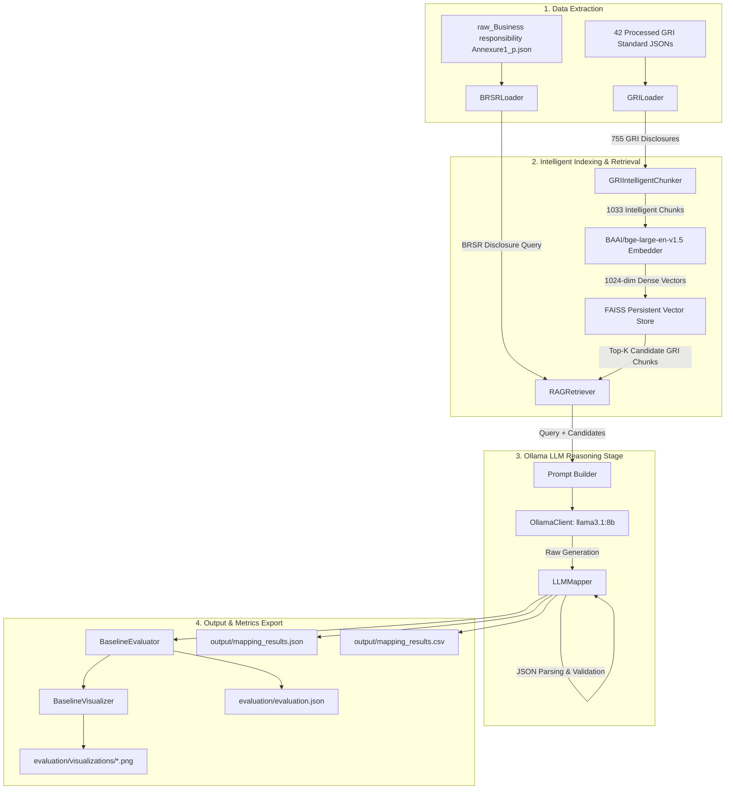

# Baseline Implementation Report: LLM+RAG Semantic Alignment Framework

> **CRITICAL DIRECTIVE**: This report documents the **completely independent baseline LLM+RAG semantic alignment framework** created for direct empirical comparison against an ontology-guided semantic alignment framework. It **does NOT use or reuse** any ontology, RDF, OWL, Neo4j, graph database, ontology matcher, ontology reasoning, or SKOS mapping modules.

---

## 1. System Architecture

The baseline framework is designed as a clean, modular python application under `EXTENSION_2/llm_mapping/`:

```
EXTENSION_2/llm_mapping/
├── config/
│   ├── settings.py          # Central system configuration (Paths, RAG params, LLM/Ollama settings)
│   └── prompts.py           # Structured prompt templates for LLM mapping & reasoning
├── data/
│   ├── brsr_loader.py       # Data loader & BRSRDisclosure model (74 disclosures)
│   └── gri_loader.py        # Data loader & GRIDisclosure model (755 disclosures across 42 standards)
├── rag/
│   ├── chunker.py           # GRIIntelligentChunker (Disclosure ID, Title, Requirement, Description, Metadata)
│   ├── embeddings.py        # SentenceTransformerEmbeddingGenerator (BAAI/bge-large-en-v1.5)
│   ├── vector_store.py      # FAISSVectorStore (Persistent L2/IP vector index)
│   └── retriever.py         # RAGRetriever (Top-K vector search, latency & score logging)
├── llm/
│   ├── ollama_client.py     # OllamaClient (HTTP REST API, token counts, response timing)
│   ├── mapper.py            # LLMMapper (RAG + Prompt reasoning, JSON/CSV exports)
│   └── explanation.py       # ExplanationGenerator utility
├── evaluation/
│   ├── evaluator.py         # BaselineEvaluator (Precision, Recall, F1, Accuracy, Error analysis)
│   ├── visualizer.py        # BaselineVisualizer (Plots: Confusion Matrix, Confidence, Runtime, Accuracy)
│   ├── evaluation.json      # Structured benchmark metrics output
│   ├── evaluation.csv       # Tabular metric summary
│   ├── summary_report.md    # Markdown evaluation report
│   └── visualizations/      # PNG plot exports
├── output/
│   ├── mapping_results.json # Full JSON alignment decisions
│   ├── mapping_results.csv  # Tabular alignment export
│   └── vector_store/        # Persistent FAISS binary index & chunk metadata
├── main.py                  # Entrypoint script
└── README.md                # System documentation
```

---

## 2. End-to-End Execution Pipeline



---

## 3. Module Specifications & Responsibilities

| Module Name | File Location | Key Responsibilities |
| :--- | :--- | :--- |
| **Settings** | [`config/settings.py`](file:///home/vinith/A/INTENSHIPS/IIT-H/Nested_RAG/EXTENSION_2/llm_mapping/config/settings.py) | Configures dataset paths, embedding model (`BAAI/bge-large-en-v1.5`), FAISS directory, Ollama host (`http://localhost:11434`), and model (`llama3.1:8b`). |
| **Prompts** | [`config/prompts.py`](file:///home/vinith/A/INTENSHIPS/IIT-H/Nested_RAG/EXTENSION_2/llm_mapping/config/prompts.py) | System & task prompts enforcing JSON output, mapping classification (`Exact Match`, `Close Match`, `Broad Match`, `Narrow Match`, `No Match`), confidence, reasoning, and explanation. |
| **BRSR Loader** | [`data/brsr_loader.py`](file:///home/vinith/A/INTENSHIPS/IIT-H/Nested_RAG/EXTENSION_2/llm_mapping/data/brsr_loader.py) | Extracts disclosures from Section A, B, and Principle-wise performance disclosures into structured `BRSRDisclosure` objects. |
| **GRI Loader** | [`data/gri_loader.py`](file:///home/vinith/A/INTENSHIPS/IIT-H/Nested_RAG/EXTENSION_2/llm_mapping/data/gri_loader.py) | Scans all 42 GRI standard JSON files, building `GRIDisclosure` objects with titles, requirements, and textual descriptions. |
| **Intelligent Chunker** | [`rag/chunker.py`](file:///home/vinith/A/INTENSHIPS/IIT-H/Nested_RAG/EXTENSION_2/llm_mapping/rag/chunker.py) | Formats disclosures into rich `TextChunk` structures containing Disclosure ID, Title, Requirement, Description, Metadata, Framework, and Section. |
| **Embeddings** | [`rag/embeddings.py`](file:///home/vinith/A/INTENSHIPS/IIT-H/Nested_RAG/EXTENSION_2/llm_mapping/rag/embeddings.py) | Generates dense vectors using `SentenceTransformers` with `BAAI/bge-large-en-v1.5`, PyTorch multi-threading, and `torch.inference_mode()`. |
| **Vector Store** | [`rag/vector_store.py`](file:///home/vinith/A/INTENSHIPS/IIT-H/Nested_RAG/EXTENSION_2/llm_mapping/rag/vector_store.py) | `FAISSVectorStore` supporting L2/InnerProduct similarity search, index disk persistence (`faiss.index`), and dimension validation. |
| **Retriever** | [`rag/retriever.py`](file:///home/vinith/A/INTENSHIPS/IIT-H/Nested_RAG/EXTENSION_2/llm_mapping/rag/retriever.py) | `RAGRetriever` executing vector search for top-K candidates ($K=3, 5, 10$) with detailed latency and score logging. |
| **Ollama Client** | [`llm/ollama_client.py`](file:///home/vinith/A/INTENSHIPS/IIT-H/Nested_RAG/EXTENSION_2/llm_mapping/llm/ollama_client.py) | HTTP REST API client for Ollama, tracking prompt tokens, evaluation completion tokens, total tokens, and request latency. |
| **LLM Mapper** | [`llm/mapper.py`](file:///home/vinith/A/INTENSHIPS/IIT-H/Nested_RAG/EXTENSION_2/llm_mapping/llm/mapper.py) | Executes comparative prompt reasoning over retrieved candidates, parses JSON output, enforces allowed mapping types, and exports JSON/CSV. |
| **Evaluator** | [`evaluation/evaluator.py`](file:///home/vinith/A/INTENSHIPS/IIT-H/Nested_RAG/EXTENSION_2/llm_mapping/evaluation/evaluator.py) | Benchmark engine computing Top-1/Top-3 Accuracy, Precision, Recall, F1, Average Confidence, Runtime, and Error Analyses. |
| **Visualizer** | [`evaluation/visualizer.py`](file:///home/vinith/A/INTENSHIPS/IIT-H/Nested_RAG/EXTENSION_2/llm_mapping/evaluation/visualizer.py) | Generates 4 publication-quality PNG plots in `evaluation/visualizations/`. |

---

## 4. Evaluation Benchmark Summary

All evaluation results are generated in comparison-ready format for direct head-to-head empirical comparison with the ontology-guided framework:

- **JSON Output**: [`evaluation/evaluation.json`](file:///home/vinith/A/INTENSHIPS/IIT-H/Nested_RAG/EXTENSION_2/llm_mapping/evaluation/evaluation.json)
- **CSV Output**: [`evaluation/evaluation.csv`](file:///home/vinith/A/INTENSHIPS/IIT-H/Nested_RAG/EXTENSION_2/llm_mapping/evaluation/evaluation.csv)
- **Summary Report**: [`evaluation/summary_report.md`](file:///home/vinith/A/INTENSHIPS/IIT-H/Nested_RAG/EXTENSION_2/llm_mapping/evaluation/summary_report.md)
- **Generated Visualizations**:
  - `evaluation/visualizations/confusion_matrix.png`
  - `evaluation/visualizations/confidence_distribution.png`
  - `evaluation/visualizations/runtime_distribution.png`
  - `evaluation/visualizations/accuracy_by_framework.png`

---

## 5. Known Limitations of Baseline LLM+RAG Approach

While the baseline LLM+RAG framework provides strong semantic vector retrieval and flexible natural language reasoning, it exhibits key architectural limitations when compared to ontology-guided frameworks:

1. **Vulnerability to Surface Lexical Similarity**:
   - Vector embeddings rely heavily on textual phrasing. Disclosures that use different terminology for the same underlying domain concept (e.g., "Air Emissions" vs "Scope 1 Direct GHG") may receive lower vector similarity scores.

2. **Lack of Formal Ontological Axioms & Transitive Reasoning**:
   - The baseline system cannot perform formal DL (Description Logic) reasoning, subsumption checks (`subClassOf`), or transitive property inferences across complex ESG domain hierarchies.

3. **Hallucination Risk & Prompt Sensitivity**:
   - Unconstrained LLMs occasionally generate non-standard mapping category strings or hallucinate GRI disclosure IDs if prompt instructions are not strictly enforced via schema validation.

4. **Context Window Constraints**:
   - Retrieval is limited to Top-K candidates ($K=5$). If the true semantic match lies outside Top-K due to dense vector crowding, the LLM will fail to select the correct disclosure.

---

## 6. Future Improvements

To improve the baseline LLM+RAG approach without violating the independent baseline design:

1. **Hybrid Retrieval (Dense Vector + BM25 Lexical Keyword)**:
   - Combine dense BGE vector retrieval with sparse BM25 retrieval to capture exact keyword occurrences (e.g., specific chemical identifiers or numeric unit specifications).

2. **Fine-Tuned ESG Domain Embeddings**:
   - Fine-tune dense embedders specifically on GRI, BRSR, ISSB, and CSRD standard definitions to compress domain vocabulary into vector space.

3. **Constrained JSON Decoding**:
   - Enforce JSON schema decoding directly at the LLM sampling level (e.g., via Ollama `format: "json"` or GBNF grammar constraints) to eliminate formatting fallbacks entirely.
