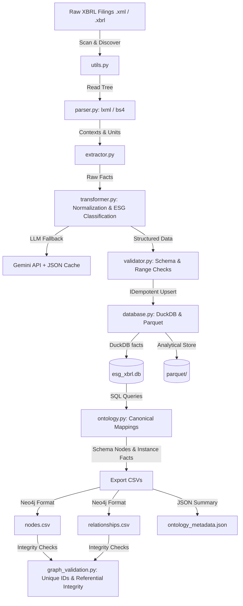

# ESG XBRL Ingestion Pipeline & Semantic Knowledge Graph Builder

This project is a production-grade, modular, and thread-safe data engineering pipeline designed to ingest National Stock Exchange (NSE) Business Responsibility and Sustainability Report (BRSR) filings, extract corporate ESG disclosures, normalize and validate the facts, and construct a Semantic Knowledge Graph mapping concepts across multiple ESG reporting frameworks (BRSR, GRI, SASB, ESRS, ISSB).

---

## 🏗️ System Architecture

The project consists of two primary operational stages:
1. **ESG Ingestion Pipeline**: Scans raw XBRL documents, parses XML structures, normalizes values, validates constraints, and writes analytical stores (DuckDB + Parquet).
2. **Ontology & Knowledge Graph Builder**: Builds semantic mappings, exports Neo4j-compatible Node and Edge CSV files, and runs validation constraints on the graph.



---

## 📁 Project Modules

*   **`config.py`**: Declares central configuration constants, including XML namespace mappings, folder directories, database table configurations, ESG classification keywords, and the fallback LLM configuration.
*   **`models.py`**: Implements immutable Python dataclasses (`Context`, `Unit`, `Fact`, `ReportMetadata`) representing structured XBRL elements.
*   **`parser.py`**: Leverages `lxml` for rapid XML tree parsing, featuring a resilient fallback to `BeautifulSoup` for corrupted or non-standard filings.
*   **`extractor.py`**: Resolves company metadata, identifies report years, and extracts and binds contexts and units to individual XBRL facts.
*   **`transformer.py`**: Normalizes numeric values, percentages, dates, and boolean states. Categorizes facts into ESG categories using a hybrid keyword lookup and Gemini LLM fallback with localized JSON caching.
*   **`validator.py`**: Runs business checks including non-negativity checks for counts/turnover and range limits on percentage metrics.
*   **`database.py`**: Executes transactional, delete-then-insert (idempotent) database writes to DuckDB and exports partitioned Parquet files.
*   **`main.py`**: Orchestrates parallel worker threads, handles task resume states, and outputs overall ingestion metrics.
*   **`ontology.py`**: Configures the ESG semantic model, maps raw BRSR concept tags to canonical metrics, and models framework associations.
*   **`graph_validation.py`**: Validates the Knowledge Graph for duplicate IDs, referential integrity (dangling relationships), and schema coverage.
*   **`build_graph.py`**: The CLI runner that pulls database facts, constructs the ontology, exports CSVs, and prints the validation summary.

---

## 🗄️ Database Schema & Data Warehouse

### DuckDB Table Schema: `esg_facts`
| Column Name | Type | Description |
| :--- | :--- | :--- |
| `concept` | `VARCHAR` | Original XBRL tag name (e.g. `TotalScope1Emissions`) |
| `namespace` | `VARCHAR` | Associated namespace URI (e.g. `https://www.sebi.gov.in/xbrl/in-capmkt`) |
| `value` | `VARCHAR` | Raw text value extracted from XML |
| `context_ref` | `VARCHAR` | Reference ID linking to context dimensions and date bounds |
| `unit_ref` | `VARCHAR` | Unit of measurement (e.g. `INR`, `Megajoule`, `tCO2e`) |
| `decimals` | `VARCHAR` | Decimal precision attribute from the fact element |
| `normalized_value` | `VARCHAR` | Standardized Python/SQL value (numeric, boolean, ISO date, or string) |
| `value_type` | `VARCHAR` | Target data type (`numeric`, `percentage`, `boolean`, `date`, `text`) |
| `category` | `VARCHAR` | Resolved ESG category (`Environmental`, `Social`, `Governance`, `Other`) |
| `company_name` | `VARCHAR` | Full resolved name of the reporting entity |
| `report_year` | `VARCHAR` | Calendar date indicating reporting year (e.g. `2025-04-01`) |
| `source_file` | `VARCHAR` | Raw filename from which the fact was extracted |
| `period_type` | `VARCHAR` | Duration or instant type identifier |
| `start_date` | `VARCHAR` | Start date bound for duration facts |
| `end_date` | `VARCHAR` | End date bound for duration facts |
| `instant_date` | `VARCHAR` | Point-in-time date for instant facts |
| `dimensions_json` | `VARCHAR` | JSON string representing context dimensions (e.g., location, segmentation) |

---

## 🕸️ Knowledge Graph Ontology Design

The Semantic Knowledge Graph binds instance-level data (raw facts reported by companies) to schema-level semantic definitions.

### 1. Node Types
*   **`Company`**: Represents the reporting corporate entity (e.g. `TCS`, `RELIANCE`).
*   **`Year`**: Represents the reporting calendar year (e.g. `Year_2025`).
*   **`Category`**: Root level ESG themes (`Category_Environmental`, `Category_Social`, `Category_Governance`, `Category_Other`).
*   **`Standard`**: ESG Reporting standards (`Standard_BRSR`, `Standard_GRI`, `Standard_SASB`, `Standard_ESRS`, `Standard_ISSB`).
*   **`ESGMetric`**: Represents one of three concepts:
    *   **Fact Instance**: A specific reported value (e.g. `Fact_TCS_TotalScope1Emissions_2025_56a5e938`).
    *   **Canonical Concept**: Unified ESG metrics (e.g. `Scope1Emission`, `CSRSpending`).
    *   **Framework Tag**: Reporting tags defined by other standards (e.g. `SASB_GrossScope1Emissions`).

### 2. Relationship Types
*   `(:Company)-[:REPORTS]->(:Year)`
*   `(:Company)-[:HAS_METRIC]->(:ESGMetric {Fact})`
*   `(:ESGMetric {Fact})-[:DISCLOSED_IN]->(:Year)`
*   `(:ESGMetric {Fact})-[:BELONGS_TO]->(:Category)`
*   `(:ESGMetric {Fact})-[:MAPS_TO]->(:Standard)`
*   `(:ESGMetric {Fact})-[:MAPS_TO]->(:ESGMetric {CanonicalConcept})`
*   `(:ESGMetric {FrameworkTag})-[:MAPS_TO]->(:ESGMetric {CanonicalConcept})`
*   `(:ESGMetric {FrameworkTag})-[:BELONGS_TO]->(:Standard)`

---

## 📥 Neo4j Importing Guide

The exported CSV files are pre-formatted for direct loading using the Neo4j bulk importer. 

### Node Header Mapping (`nodes.csv`)
*   `id:ID`: Unique node identifier.
*   `label:LABEL`: Semi-colon separated Neo4j node labels (e.g. `ESGMetric;Fact`).
*   `name`: Node display name.
*   *Additional columns: `concept`, `value`, `normalized_value`, `value_type`, `unit_ref`, `source_file`, `dimensions`, `description`.*

### Relationship Header Mapping (`relationships.csv`)
*   `start_id:START_ID`: Source node identifier.
*   `end_id:END_ID`: Destination node identifier.
*   `type:TYPE`: Neo4j relationship type (e.g. `HAS_METRIC`).

### Cypher Load Query Example
To import the generated CSVs directly into an active Neo4j graph instance, run these Cypher queries:

```cypher
// 1. Create constraints for fast merges
CREATE CONSTRAINT UNIQUE_IDS FOR (n:Company) REQUIRE n.id IS UNIQUE;
CREATE CONSTRAINT UNIQUE_METRICS FOR (n:ESGMetric) REQUIRE n.id IS UNIQUE;

// 2. Load Nodes
LOAD CSV WITH HEADERS FROM 'file:///nodes.csv' AS row
WITH row, split(row.`label:LABEL`, ';') AS labels
CALL apoc.create.node(labels, {
    id: row.`id:ID`,
    name: row.name,
    concept: row.concept,
    value: row.value,
    normalized_value: row.normalized_value,
    value_type: row.value_type,
    unit_ref: row.unit_ref,
    source_file: row.source_file,
    dimensions: row.dimensions,
    description: row.description
}) YIELD node
RETURN count(node);

// 3. Load Relationships
LOAD CSV WITH HEADERS FROM 'file:///relationships.csv' AS row
MATCH (s {id: row.`start_id:START_ID`})
MATCH (e {id: row.`end_id:END_ID`})
CALL apoc.create.relationship(s, row.`type:TYPE`, {}, e) YIELD rel
RETURN count(rel);
```

---

## 🛠️ Step-by-Step Execution Guide

### 1. Ingestion Pipeline Command
```bash
# Navigate to subfolder
cd /home/vinith/A/INTENSHIPS/IIT-H/Nested_RAG/ESG_XBRL_P_V_IITH

# Run ingestion pipeline
python3 main.py --workers 4
```
*   `--workers 4` specifies four concurrent threads scanning, parsing, and validating XML filings.
*   Check the generated log file `output/pipeline.log` for runtime exceptions or warning logs.

### 2. Knowledge Graph Command
```bash
python3 build_graph.py
```
*   Queries the `esg_facts` DuckDB table, runs the mapping engine to resolve canonical metrics, generates nodes and relationships, and outputs the graph.
*   Executes `KGValidator` to ensure 100% referential integrity and lack of duplicate node IDs.

---

## 📋 Graph Quality & Consistency Report

The validator runs a series of strict assertion rules before saving the graph:
1.  **Duplicate check**: Ensures every value in `id:ID` is completely unique.
2.  **Dangling edge check**: Verifies that every `:START_ID` and `:END_ID` in the relationships file corresponds to an existing `:ID` in the nodes file.
3.  **Schema coverage**: Guarantees all 8 core ESG canonical concepts are present.
4.  **Formatting check**: Asserts no blank fields are present in primary identifiers.